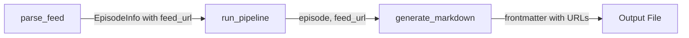

# Design Document: Enhanced Metadata

## Overview

This design extends the podcast transcription output to include additional metadata fields in the YAML frontmatter: the podcast feed URL and the episode media URL. These additions provide better traceability from the transcribed content back to its source.

The implementation requires minimal changes across three layers:
1. **Data Layer**: Extend `EpisodeInfo` dataclass with an optional `feed_url` field
2. **Service Layer**: Update `parse_feed()` to populate the new field
3. **Output Layer**: Update `_format_frontmatter()` to include both URLs

## Architecture

The existing layered architecture remains unchanged:

```
CLI → Core (Pipeline, Output) → Services (RSS, Transcriber, Claude)
```

Data flows through the system as follows:



The feed URL originates at the RSS parsing stage and flows through the pipeline to the output generator. The media URL already exists in `EpisodeInfo` and just needs to be included in the frontmatter.

## Components and Interfaces

### EpisodeInfo Dataclass (Modified)

**File**: `src/podtext/services/rss.py`

```python
@dataclass
class EpisodeInfo:
    """Represents a podcast episode from an RSS feed."""
    
    index: int
    title: str
    pub_date: datetime
    media_url: str
    feed_url: str | None = None  # NEW: Optional feed URL
```

The `feed_url` field is optional (defaults to `None`) to maintain backward compatibility with any code that creates `EpisodeInfo` instances without providing a feed URL.

### parse_feed Function (Modified)

**File**: `src/podtext/services/rss.py`

```python
def parse_feed(
    feed_url: str,
    limit: int = 10,
    timeout: float = DEFAULT_TIMEOUT,
) -> list[EpisodeInfo]:
    # ... existing implementation ...
    
    # When creating EpisodeInfo, include the feed_url
    episodes.append(
        EpisodeInfo(
            index=0,
            title=str(title),
            pub_date=pub_date,
            media_url=str(media_url),
            feed_url=feed_url,  # NEW: Pass through the feed URL
        )
    )
```

### _format_frontmatter Function (Modified)

**File**: `src/podtext/core/output.py`

```python
def _format_frontmatter(
    episode: "EpisodeInfo",
    analysis: "AnalysisResult",
    podcast_name: str = "",
) -> str:
    frontmatter_data: dict[str, str | list[str]] = {
        "title": episode.title,
        "pub_date": episode.pub_date.strftime("%Y-%m-%d"),
    }
    
    if podcast_name:
        frontmatter_data["podcast"] = podcast_name
    
    # NEW: Add feed_url if available
    if episode.feed_url:
        frontmatter_data["feed_url"] = episode.feed_url
    
    # NEW: Add media_url (always available)
    frontmatter_data["media_url"] = episode.media_url
    
    # ... rest of existing implementation (summary, topics, keywords) ...
```

## Data Models

### EpisodeInfo (Extended)

| Field | Type | Required | Description |
|-------|------|----------|-------------|
| index | int | Yes | 1-based episode index |
| title | str | Yes | Episode title |
| pub_date | datetime | Yes | Publication date |
| media_url | str | Yes | Direct URL to audio/video file |
| feed_url | str \| None | No | RSS feed URL (new field) |

### Frontmatter Schema (Extended)

| Field | Type | Condition | Description |
|-------|------|-----------|-------------|
| title | str | Always | Episode title |
| pub_date | str | Always | ISO date (YYYY-MM-DD) |
| podcast | str | If provided | Podcast name |
| feed_url | str | If available | RSS feed URL (new) |
| media_url | str | Always | Episode media URL (new) |
| summary | str | If analysis | AI-generated summary |
| topics | list[str] | If analysis | Topic list |
| keywords | list[str] | If analysis | Keyword list |

### Example Output

```yaml
---
title: "Episode 42: The Answer"
pub_date: "2024-01-15"
podcast: "My Podcast"
feed_url: "https://example.com/podcast/feed.xml"
media_url: "https://example.com/episodes/ep42.mp3"
summary: "A discussion about the meaning of life..."
topics:
  - "Philosophy"
  - "Science"
keywords:
  - meaning
  - universe
---
```


## Correctness Properties

*A property is a characteristic or behavior that should hold true across all valid executions of a system—essentially, a formal statement about what the system should do. Properties serve as the bridge between human-readable specifications and machine-verifiable correctness guarantees.*

### Property 1: Feed URL Round-Trip

*For any* EpisodeInfo with a non-None feed_url, generating frontmatter and parsing the resulting YAML should yield the same feed_url value.

**Validates: Requirements 1.1, 1.3**

### Property 2: Media URL Round-Trip

*For any* EpisodeInfo with a media_url, generating frontmatter and parsing the resulting YAML should yield the same media_url value.

**Validates: Requirements 2.1, 2.2**

### Property 3: Existing Fields Preserved

*For any* valid EpisodeInfo and AnalysisResult, the generated frontmatter should contain all existing fields (title, pub_date) and conditionally include podcast, summary, topics, and keywords when provided.

**Validates: Requirements 3.1, 3.2**

### Property 4: Parse Feed Populates Feed URL

*For any* valid RSS feed URL, all EpisodeInfo objects returned by parse_feed should have their feed_url field set to the input feed URL.

**Validates: Requirements 4.2**

## Error Handling

| Scenario | Behavior |
|----------|----------|
| feed_url is None | Omit `feed_url` field from frontmatter (graceful degradation) |
| media_url is empty string | Include empty string in frontmatter (data integrity) |
| Invalid YAML characters in URLs | YAML library handles escaping automatically |

The implementation follows the existing pattern of graceful degradation—missing optional data results in omitted fields rather than errors.

## Testing Strategy

### Unit Tests

- Test `_format_frontmatter()` with various combinations of inputs
- Test `EpisodeInfo` dataclass with and without feed_url
- Test edge cases: None feed_url, empty strings, special characters in URLs

### Property-Based Tests

Property-based tests will use the `hypothesis` library with minimum 100 iterations per test.

Each property test should be tagged with:
- **Feature: enhanced-metadata, Property {N}: {property_text}**

| Property | Test Description |
|----------|------------------|
| Property 1 | Generate random feed URLs, create frontmatter, parse YAML, verify feed_url matches |
| Property 2 | Generate random media URLs, create frontmatter, parse YAML, verify media_url matches |
| Property 3 | Generate random EpisodeInfo/AnalysisResult, verify all expected fields present |
| Property 4 | Mock RSS feed responses, verify all returned episodes have correct feed_url |

### Test Configuration

```python
from hypothesis import given, settings, strategies as st

@settings(max_examples=100)
@given(feed_url=st.text(min_size=1).filter(lambda x: x.strip()))
def test_feed_url_round_trip(feed_url: str) -> None:
    """Feature: enhanced-metadata, Property 1: Feed URL Round-Trip"""
    # ... test implementation
```
