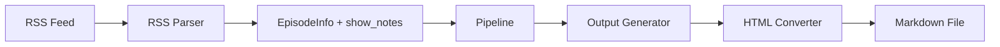

# Design Document: Include Show Notes

## Overview

This feature extends the podcast transcription pipeline to extract show notes from RSS feed entries and append them to the generated markdown output. The implementation involves three main changes:

1. **Data Model Update**: Add a `show_notes` field to the `EpisodeInfo` dataclass
2. **RSS Parsing Enhancement**: Extract show notes from feed entries during parsing
3. **Output Generation Update**: Append a "Show Notes" section to the markdown output
4. **HTML Conversion**: Convert HTML-formatted show notes to clean markdown

## Architecture

The feature follows the existing layered architecture:

```
CLI → Core (Pipeline, Output) → Services (RSS Parser)
                ↓
         HTML Converter (new utility)
```

Data flows from RSS parsing through the pipeline to output generation:



## Components and Interfaces

### 1. EpisodeInfo Dataclass Update

**Location**: `src/podtext/services/rss.py`

```python
@dataclass
class EpisodeInfo:
    """Represents a podcast episode from an RSS feed."""
    
    index: int
    title: str
    pub_date: datetime
    media_url: str
    show_notes: str = ""  # New field with empty default
```

### 2. Show Notes Extraction Function

**Location**: `src/podtext/services/rss.py`

```python
def _extract_show_notes(entry: Any) -> str:
    """Extract show notes from an RSS feed entry.
    
    Checks fields in priority order: content, summary, description.
    
    Args:
        entry: A feedparser entry object.
        
    Returns:
        Show notes content as string, or empty string if not found.
    """
```

**Field Priority**:
1. `entry.content[0].value` - Full content (often HTML)
2. `entry.summary` - Summary/description field
3. `entry.description` - Alternative description field

### 3. HTML to Markdown Converter

**Location**: `src/podtext/core/processor.py`

```python
def convert_html_to_markdown(html_content: str) -> str:
    """Convert HTML content to markdown format.
    
    Handles common HTML elements found in podcast show notes:
    - Links (<a>) → [text](url)
    - Lists (<ul>, <ol>, <li>) → markdown lists
    - Headings (<h1>-<h6>) → # headings
    - Paragraphs (<p>) → double newlines
    - Bold/italic → **bold**, *italic*
    - Strips unsupported tags, preserves text
    
    Args:
        html_content: HTML string to convert.
        
    Returns:
        Markdown-formatted string.
    """
```

**Implementation Approach**: Use Python's `html.parser` module for lightweight parsing without external dependencies. The converter will:
1. Parse HTML tags and convert supported elements
2. Strip unsupported tags while preserving inner text
3. Handle malformed HTML gracefully
4. Normalize whitespace

### 4. Output Generator Update

**Location**: `src/podtext/core/output.py`

```python
def _format_show_notes(show_notes: str, max_length: int = 50000) -> str:
    """Format show notes for markdown output.
    
    Args:
        show_notes: Raw show notes content (may be HTML).
        max_length: Maximum character length before truncation.
        
    Returns:
        Formatted show notes section, or empty string if no notes.
    """
```

**Output Format**:
```markdown
## Show Notes

[Converted markdown content from show notes]
```

### 5. Updated generate_markdown Signature

The `generate_markdown` and `generate_markdown_string` functions will automatically use the `show_notes` field from `EpisodeInfo` - no signature changes needed.

## Data Models

### EpisodeInfo (Updated)

| Field | Type | Description |
|-------|------|-------------|
| index | int | Episode index (1-based, most recent first) |
| title | str | Episode title |
| pub_date | datetime | Publication date |
| media_url | str | URL to media file |
| show_notes | str | Show notes content (new, default: "") |

### HTML Elements Supported for Conversion

| HTML Element | Markdown Output |
|--------------|-----------------|
| `<a href="url">text</a>` | `[text](url)` |
| `<p>text</p>` | `text\n\n` |
| `<br>` or `<br/>` | `\n` |
| `<strong>`, `<b>` | `**text**` |
| `<em>`, `<i>` | `*text*` |
| `<h1>`-`<h6>` | `#`-`######` |
| `<ul><li>` | `- item` |
| `<ol><li>` | `1. item` |
| `<code>` | `` `code` `` |
| Other tags | Strip tag, keep text |


## Correctness Properties

*A property is a characteristic or behavior that should hold true across all valid executions of a system—essentially, a formal statement about what the system should do. Properties serve as the bridge between human-readable specifications and machine-verifiable correctness guarantees.*

### Property 1: Show Notes Extraction Priority

*For any* RSS feed entry containing multiple show notes fields (content, summary, description), the extracted show notes SHALL equal the value of the highest-priority non-empty field, where priority is: content > summary > description.

**Validates: Requirements 1.1, 1.2**

### Property 2: Show Notes Section Formatting

*For any* EpisodeInfo with non-empty show notes, the generated markdown output SHALL contain a "## Show Notes" heading followed by the show notes content, with a blank line separating it from the transcribed content. *For any* EpisodeInfo with empty show notes, the output SHALL NOT contain a "## Show Notes" section.

**Validates: Requirements 2.1, 2.2, 2.3, 2.4**

### Property 3: HTML to Markdown Content Preservation

*For any* HTML string input to the converter, the output SHALL be valid markdown containing all text content from the input, with HTML links converted to `[text](url)` format, lists converted to markdown list syntax, and headings converted to `#` syntax. *For any* plain text input (no HTML tags), the output SHALL equal the input.

**Validates: Requirements 3.1, 3.2, 3.3, 3.4, 3.5, 3.6**

### Property 4: Malformed HTML Graceful Handling

*For any* malformed HTML input (unclosed tags, invalid nesting), the HTML converter SHALL produce output containing the readable text content without raising exceptions.

**Validates: Requirements 4.1**

### Property 5: Long Content Truncation

*For any* show notes exceeding 50,000 characters, the formatted output SHALL be truncated to at most 50,000 characters plus a truncation notice.

**Validates: Requirements 4.2**

### Property 6: Unicode Preservation

*For any* show notes containing Unicode characters, the characters SHALL be preserved unchanged through extraction, conversion, and output generation.

**Validates: Requirements 4.4**

## Error Handling

| Error Condition | Handling Strategy | User Impact |
|-----------------|-------------------|-------------|
| Missing show notes fields | Return empty string | No show notes section in output |
| Malformed HTML | Extract text content, log warning | Degraded formatting, content preserved |
| Extraction exception | Log warning, continue with empty | No show notes section in output |
| Encoding errors | Use UTF-8 with error replacement | Some characters may be replaced |
| Excessive length | Truncate with notice | Partial show notes with indicator |

## Testing Strategy

### Unit Tests

Unit tests will cover specific examples and edge cases:

1. **RSS Extraction Tests**
   - Entry with only `content` field
   - Entry with only `summary` field
   - Entry with only `description` field
   - Entry with no show notes fields
   - Entry with all fields (verify priority)

2. **HTML Converter Tests**
   - Simple paragraph conversion
   - Link conversion with various URL formats
   - Nested list conversion
   - Mixed content (text, links, lists)
   - Malformed HTML examples
   - Plain text passthrough

3. **Output Generator Tests**
   - Episode with show notes
   - Episode without show notes
   - Show notes at truncation boundary

### Property-Based Tests

Property-based tests will use Hypothesis to verify universal properties:

- **Library**: `hypothesis`
- **Minimum iterations**: 100 per property
- **Tag format**: `Feature: include-shownotes, Property N: [property_text]`

Each correctness property will be implemented as a single property-based test:

1. **Property 1 Test**: Generate random RSS entries with various field combinations, verify extraction priority
2. **Property 2 Test**: Generate random EpisodeInfo objects, verify output formatting rules
3. **Property 3 Test**: Generate random HTML strings, verify content preservation and format conversion
4. **Property 4 Test**: Generate malformed HTML, verify no exceptions and text extraction
5. **Property 5 Test**: Generate long strings, verify truncation behavior
6. **Property 6 Test**: Generate Unicode strings, verify preservation through pipeline
