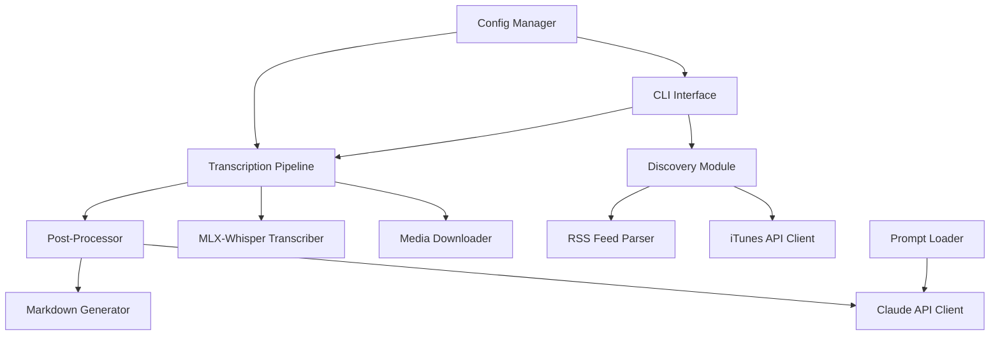

# Design Document: Podtext

## Overview

Podtext is a CLI tool for podcast transcription and analysis. It follows a pipeline architecture: discovery → download → transcription → post-processing → output. The system is designed for Apple Silicon optimization via MLX-Whisper and integrates with Claude AI for intelligent content analysis.

## Architecture



### Module Responsibilities

1. **CLI Interface**: Argument parsing, command routing, user output
2. **Discovery Module**: Podcast search and episode listing
3. **Transcription Pipeline**: Orchestrates download → transcribe → process flow
4. **Config Manager**: TOML loading, environment variable handling
5. **Claude API Client**: Advertisement detection, content analysis
6. **Markdown Generator**: Output file creation with frontmatter

## Components and Interfaces

### CLI Commands

```
podtext search <keywords> [--limit N]
podtext episodes <feed-url> [--limit N]
podtext transcribe <feed-url> <index> [--skip-language-check]
```

### Core Interfaces

```python
# Discovery
class PodcastSearchResult:
    title: str
    feed_url: str

class EpisodeInfo:
    index: int
    title: str
    pub_date: datetime
    media_url: str

# Transcription
class TranscriptionResult:
    text: str
    paragraphs: list[str]
    language: str

# Analysis
class AnalysisResult:
    summary: str
    topics: list[str]
    keywords: list[str]
    ad_markers: list[tuple[int, int]]  # start, end positions
```

### Module Interfaces

```python
# iTunes API Client
def search_podcasts(query: str, limit: int = 10) -> list[PodcastSearchResult]

# RSS Parser
def parse_feed(feed_url: str, limit: int = 10) -> list[EpisodeInfo]

# Media Downloader
def download_media(url: str, dest_path: Path) -> Path

# Transcriber
def transcribe(audio_path: Path, model: str = "base") -> TranscriptionResult

# Claude Client
def detect_advertisements(text: str) -> list[tuple[int, int]]
def analyze_content(text: str) -> AnalysisResult

# Output Generator
def generate_markdown(
    episode: EpisodeInfo,
    transcription: TranscriptionResult,
    analysis: AnalysisResult,
    output_path: Path
) -> None
```

## Data Models

### Configuration Schema (TOML)

```toml
[api]
anthropic_key = ""  # Optional, env var takes precedence

[storage]
media_dir = ".podtext/downloads/"
output_dir = ".podtext/output/"
temp_storage = false  # Delete media after transcription

[whisper]
model = "base"  # tiny, base, small, medium, large
```

### Output Markdown Structure

```markdown
---
title: "Episode Title"
pub_date: "2024-01-15"
podcast: "Podcast Name"
summary: "AI-generated summary..."
topics:
  - "Topic one sentence"
  - "Topic two sentence"
keywords:
  - keyword1
  - keyword2
---

Transcribed content with paragraphs...

[ADVERTISEMENT WAS REMOVED]

More content...
```

### Prompts File Structure

```markdown
# Advertisement Detection

Analyze the following transcript and identify advertising sections...

# Content Summary

Summarize the following podcast transcript...

# Topic Extraction

List the main topics covered...

# Keyword Extraction

Extract relevant keywords...
```

## Correctness Properties

*A property is a characteristic or behavior that should hold true across all valid executions of a system—essentially, a formal statement about what the system should do. Properties serve as the bridge between human-readable specifications and machine-verifiable correctness guarantees.*

### Property 1: Result Limiting

*For any* search or episode listing operation with limit N, the returned results SHALL have length ≤ N.

**Validates: Requirements 1.3, 1.4, 2.3, 2.4**

### Property 2: Search Result Display Completeness

*For any* list of PodcastSearchResult objects, the formatted display output SHALL contain both the title and feed_url for each result.

**Validates: Requirements 1.2**

### Property 3: Episode Display Completeness

*For any* list of EpisodeInfo objects, the formatted display output SHALL contain the title, publication date, and index number for each episode.

**Validates: Requirements 2.2**

### Property 4: RSS Parsing Validity

*For any* valid RSS feed XML, parsing then extracting episode info SHALL produce EpisodeInfo objects with non-empty title, valid datetime, and valid media URL.

**Validates: Requirements 2.1**

### Property 5: Media Storage Location

*For any* configuration with media_dir set to path P, downloaded media files SHALL be stored within path P.

**Validates: Requirements 3.2**

### Property 6: Temporary File Cleanup

*For any* transcription operation with temp_storage=true, after completion the media file SHALL not exist on disk.

**Validates: Requirements 3.3**

### Property 7: Config Model Propagation

*For any* configuration with whisper.model set to M, the transcription function SHALL be called with model parameter M.

**Validates: Requirements 4.2**

### Property 8: Markdown Output Completeness

*For any* EpisodeInfo and AnalysisResult, the generated markdown SHALL contain valid YAML frontmatter with title, pub_date, summary, topics, and keywords fields.

**Validates: Requirements 4.4, 4.5, 7.6**

### Property 9: Language Check Bypass

*For any* transcription operation with skip-language-check flag set, the language detection function SHALL not be called.

**Validates: Requirements 5.3**

### Property 10: Advertisement Removal with Markers

*For any* transcription text with identified advertisement blocks, the output text SHALL not contain the advertisement content AND SHALL contain "ADVERTISEMENT WAS REMOVED" marker for each removed block.

**Validates: Requirements 6.2, 6.3**

### Property 11: Config Loading Priority

*For any* configuration key present in both local and global config files, the value from the local config file SHALL be used.

**Validates: Requirements 8.1, 8.2**

### Property 12: Environment Variable Precedence

*For any* ANTHROPIC_API_KEY environment variable value V, the Claude API client SHALL use V regardless of config file value.

**Validates: Requirements 8.5**

### Property 13: Prompt Runtime Loading

*For any* modification to the prompts markdown file, subsequent Claude API calls SHALL use the updated prompt content.

**Validates: Requirements 9.2**

## Error Handling

| Error Condition | Behavior |
|----------------|----------|
| iTunes API error | Display error message, exit with non-zero code |
| Invalid/unreachable RSS feed | Display error message, exit with non-zero code |
| Media download failure | Display error message, exit with non-zero code |
| Non-English audio detected | Display warning, continue transcription |
| Claude API unavailable | Display warning, output transcript without AI analysis |
| Missing prompts file | Display warning, use built-in defaults |
| Malformed prompts file | Display warning, use built-in defaults |
| Missing config file (global) | Create with defaults, continue |
| Invalid config file | Display error message, exit with non-zero code |

## Testing Strategy

### Unit Tests

Unit tests verify specific examples and edge cases:

- CLI argument parsing (valid/invalid inputs)
- Config file loading (missing, malformed, valid)
- RSS feed parsing (various feed formats)
- Markdown generation (frontmatter validation)
- Error handling paths

### Property-Based Tests

Property tests use Hypothesis library to verify universal properties across generated inputs:

- **Minimum 100 iterations per property test**
- Each test tagged with: `Feature: podtext, Property N: <property_text>`

| Property | Test Strategy |
|----------|---------------|
| Result Limiting | Generate random result lists, verify length ≤ limit |
| Display Completeness | Generate random results, verify all fields in output |
| RSS Parsing | Generate valid RSS XML, verify parsed structure |
| Storage Location | Generate config paths, verify file locations |
| Temp Cleanup | Run transcription with temp=true, verify file deleted |
| Config Priority | Generate overlapping configs, verify local wins |
| Env Var Precedence | Set env var, verify it's used over config |
| Ad Removal | Generate text with marked ads, verify removal + markers |

### Integration Tests

- End-to-end transcription pipeline (with mocked external APIs)
- Config file creation on first run
- CLI command execution

