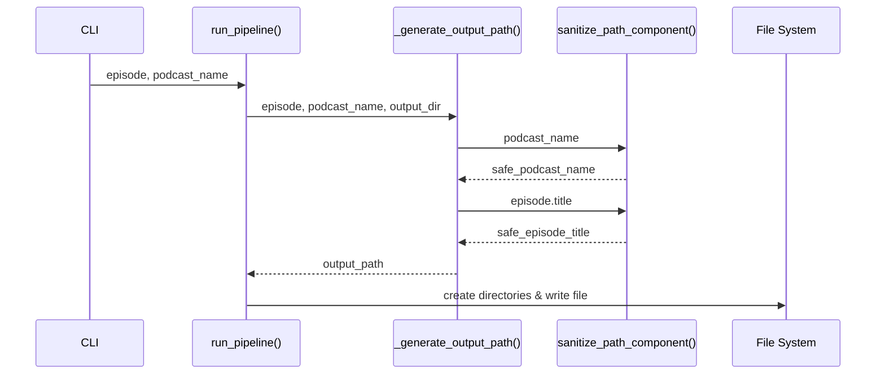

# Design Document: Semantic File Naming

## Overview

This design introduces a hierarchical file naming system for podcast transcription output. The system organizes transcribed episodes into podcast-specific subdirectories with sanitized, human-readable filenames limited to 30 characters.

The implementation adds a new `sanitize_path_component()` utility function and updates the existing `_generate_output_filename()` function to produce paths in the format `<output-dir>/<podcast-name>/<episode-title>.md`.

## Architecture

The feature follows the existing layered architecture:

```
CLI Layer (cli/main.py)
    │
    ▼
Core Layer (core/pipeline.py, core/processor.py)
    │
    ├── _generate_output_path() - Updated to create hierarchical paths
    │
    └── sanitize_path_component() - New utility for path sanitization
```

### Component Interaction



## Components and Interfaces

### New Component: Path Sanitizer

**Location:** `src/podtext/core/processor.py`

```python
def sanitize_path_component(
    name: str,
    max_length: int = 30,
    fallback: str = "unknown",
) -> str:
    """Sanitize a string for use as a file system path component.
    
    Args:
        name: The string to sanitize (podcast name or episode title).
        max_length: Maximum length of the result (default: 30).
        fallback: Value to return if sanitization results in empty string.
        
    Returns:
        A sanitized string safe for use in file paths.
        
    Validates: Requirements 2.1, 2.2, 2.3, 2.4, 2.5, 3.1, 3.2, 3.3, 4.3
    """
```

**Sanitization Algorithm:**
1. Replace invalid characters (`/ \ : * ? " < > |`) with underscores
2. Preserve alphanumeric characters, spaces, hyphens, and underscores
3. Collapse multiple consecutive underscores into single underscore
4. Trim leading/trailing whitespace and underscores
5. Truncate to max_length, preferring word boundaries
6. Return fallback if result is empty

### Updated Component: Output Path Generator

**Location:** `src/podtext/core/pipeline.py`

The existing `_generate_output_filename()` function will be replaced with `_generate_output_path()`:

```python
def _generate_output_path(
    episode: EpisodeInfo,
    podcast_name: str,
    output_dir: Path,
) -> Path:
    """Generate the full output path for a transcribed episode.
    
    Creates a path in the format: <output_dir>/<podcast_name>/<episode_title>.md
    
    Args:
        episode: Episode information from RSS feed.
        podcast_name: Name of the podcast.
        output_dir: Base output directory from config.
        
    Returns:
        Full path for the output markdown file.
        
    Validates: Requirements 1.1, 1.2, 4.1, 4.2, 4.4
    """
```

### Updated Component: Pipeline Integration

**Location:** `src/podtext/core/pipeline.py`

The `run_pipeline()` function will be updated to:
1. Use `_generate_output_path()` instead of `_generate_output_filename()`
2. Pass `podcast_name` to the path generator
3. Handle the case when `podcast_name` is empty

## Data Models

### Input Data

The feature uses existing data models:

```python
@dataclass
class EpisodeInfo:
    index: int        # Episode number (1-based)
    title: str        # Episode title (to be sanitized)
    pub_date: datetime
    media_url: str
```

### Configuration

No new configuration options are required. The feature uses the existing `output_dir` from config.

### Output Path Structure

```
<output_dir>/
├── <sanitized_podcast_name>/
│   ├── <sanitized_episode_title_1>.md
│   ├── <sanitized_episode_title_2>.md
│   └── ...
├── <another_podcast>/
│   └── ...
└── unknown-podcast/          # Fallback for missing podcast names
    └── ...
```


## Correctness Properties

*A property is a characteristic or behavior that should hold true across all valid executions of a system—essentially, a formal statement about what the system should do. Properties serve as the bridge between human-readable specifications and machine-verifiable correctness guarantees.*

### Property 1: Path Format Structure

*For any* valid podcast name and episode title, the generated output path SHALL have exactly three components: the output directory, a sanitized podcast subdirectory, and a sanitized episode filename with `.md` extension.

**Validates: Requirements 1.1**

### Property 2: Sanitization Correctness

*For any* input string, the sanitized output SHALL:
- Contain no invalid file path characters (`/ \ : * ? " < > |`)
- Preserve all alphanumeric characters, spaces, hyphens, and underscores from the input (subject to length limits)
- Contain no consecutive underscores
- Have no leading or trailing whitespace or underscores

**Validates: Requirements 2.1, 2.2, 2.3, 2.4, 2.5**

### Property 3: Length Constraint

*For any* input string of any length, the sanitized output SHALL be at most 30 characters long.

**Validates: Requirements 3.1**

### Property 4: Non-Empty Output

*For any* input string (including empty strings and strings with only invalid characters), the sanitized output SHALL be non-empty when a fallback value is provided.

**Validates: Requirements 4.3**

### Property 5: Sanitization Round-Trip Stability

*For any* already-sanitized string (output of sanitize_path_component), sanitizing it again SHALL produce the same result (idempotence).

**Validates: Requirements 2.1, 2.3, 2.4, 2.5, 3.1**

## Error Handling

### Path Sanitization Errors

| Scenario | Handling | Fallback |
|----------|----------|----------|
| Empty podcast name | Use fallback | `"unknown-podcast"` |
| Empty episode title | Use fallback | `"episode_{index}"` |
| Only invalid characters | Use fallback | Provided fallback value |
| Extremely long input | Truncate to 30 chars | N/A |

### File System Errors

| Scenario | Handling |
|----------|----------|
| Directory creation fails | Raise `PipelineError` with descriptive message |
| File write fails | Raise `PipelineError` with descriptive message |
| Permission denied | Raise `PipelineError` with descriptive message |

### Edge Cases

1. **Unicode characters**: Non-ASCII alphanumeric characters are preserved (e.g., "Café" → "Café")
2. **Reserved names**: Windows reserved names (CON, PRN, etc.) are not specially handled as macOS is the target platform
3. **Case sensitivity**: Filenames preserve original case; no normalization is performed

## Testing Strategy

### Unit Tests

Unit tests verify specific examples and edge cases:

1. **Sanitization examples**:
   - `"Hello World"` → `"Hello World"` (no change)
   - `"Episode: The Beginning"` → `"Episode_ The Beginning"` (colon replaced)
   - `"A/B Testing"` → `"A_B Testing"` (slash replaced)
   - `""` → `"unknown"` (empty fallback)
   - `"***"` → `"unknown"` (only invalid chars)

2. **Length truncation examples**:
   - `"This is a very long episode title that exceeds the limit"` → `"This is a very long episode"` (truncated at word boundary)

3. **Path generation examples**:
   - Podcast "My Podcast", Episode "Episode 1" → `output_dir/My Podcast/Episode 1.md`

### Property-Based Tests

Property-based tests use Hypothesis to verify universal properties across many generated inputs.

**Test Configuration**:
- Minimum 100 iterations per property test
- Use `hypothesis.strategies` for string generation
- Tag format: `Feature: semantic-file-naming, Property {number}: {property_text}`

**Property Test Implementation**:

```python
from hypothesis import given, strategies as st

@given(st.text(min_size=0, max_size=200))
def test_sanitization_correctness(input_string: str) -> None:
    """Feature: semantic-file-naming, Property 2: Sanitization Correctness"""
    result = sanitize_path_component(input_string)
    # Verify no invalid characters
    invalid_chars = set('/\\:*?"<>|')
    assert not any(c in result for c in invalid_chars)
    # Verify no consecutive underscores
    assert "__" not in result
    # Verify trimmed
    assert result == result.strip()
    assert not result.startswith("_")
    assert not result.endswith("_") or result == "unknown"

@given(st.text(min_size=0, max_size=200))
def test_length_constraint(input_string: str) -> None:
    """Feature: semantic-file-naming, Property 3: Length Constraint"""
    result = sanitize_path_component(input_string)
    assert len(result) <= 30

@given(st.text(min_size=0, max_size=200))
def test_idempotence(input_string: str) -> None:
    """Feature: semantic-file-naming, Property 5: Sanitization Round-Trip Stability"""
    first_pass = sanitize_path_component(input_string)
    second_pass = sanitize_path_component(first_pass)
    assert first_pass == second_pass
```

### Test File Organization

```
tests/
├── test_processor.py           # Unit tests for sanitize_path_component
├── test_processor_properties.py # Property tests for sanitization
├── test_pipeline.py            # Unit tests for path generation
└── test_pipeline_properties.py  # Property tests for path generation
```
