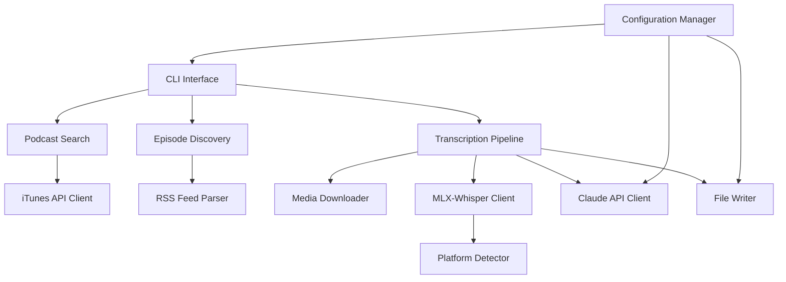
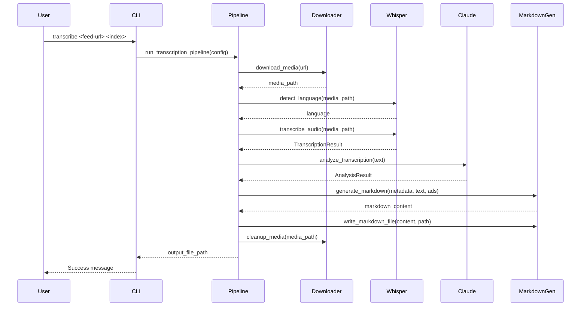

# Design Document: Podtext

## Overview

Podtext is a Python-based command-line tool that provides podcast discovery, episode retrieval, and AI-powered transcription with content analysis. The system integrates three main external services: iTunes API for podcast search, MLX-Whisper for Apple Silicon-optimized transcription, and Claude API for intelligent content analysis and advertising detection.

The architecture follows a modular design with clear separation between CLI interface, business logic, external integrations, and file management. This enables independent testing of components and flexible configuration of behavior.

## Architecture

### High-Level Architecture



### Component Layers

1. **CLI Layer**: Argument parsing, sub-command routing, user interaction
2. **Business Logic Layer**: Orchestration of workflows, data transformation
3. **Integration Layer**: External API clients (iTunes, Claude), RSS parsing, Whisper integration
4. **Storage Layer**: File I/O, configuration management, markdown generation
5. **Platform Layer**: Hardware detection, environment validation

## Components and Interfaces

### 1. CLI Interface (`cli.py`)

**Responsibility**: Parse command-line arguments and route to appropriate handlers

**Sub-commands**:
- `search <keywords>` - Search for podcasts
- `episodes <feed-url>` - List episodes from a feed
- `transcribe <feed-url> <index>` - Download and transcribe an episode

**Common Flags**:
- `--limit N` - Number of results to display (default: 10)
- `--no-lang-check` - Skip language verification
- `--no-ad-removal` - Disable advertising detection
- `--keep-media` - Retain media files after processing
- `--confidence N` - Ad removal confidence threshold (default: 90)
- `--output-dir PATH` - Storage location for output files

**Interface**:
```python
def main() -> int:
    """Entry point for CLI application"""
    
def search_command(keywords: str, limit: int) -> None:
    """Execute podcast search"""
    
def episodes_command(feed_url: str, limit: int) -> None:
    """Execute episode listing"""
    
def transcribe_command(
    feed_url: str,
    index: int,
    config: Config,
    flags: TranscribeFlags
) -> None:
    """Execute transcription pipeline"""
```

### 2. Configuration Manager (`config.py`)

**Responsibility**: Load, validate, and provide access to configuration values

**Configuration Sources** (priority order):
1. Command-line flags
2. Environment variables
3. Local config file (`.podtext/config`)
4. Home config file (`$HOME/.podtext/config`)
5. Default values

**Config Schema** (TOML):
```toml
[api]
claude_api_key = ""
claude_model = "claude-4.5-sonnet"

[storage]
output_dir = "./podtext_output"
keep_media_files = false

[transcription]
skip_language_check = false

[analysis]
remove_ads = true
ad_confidence_threshold = 90
```

**Interface**:
```python
@dataclass
class Config:
    claude_api_key: str
    claude_model: str
    output_dir: Path
    keep_media_files: bool
    skip_language_check: bool
    remove_ads: bool
    ad_confidence_threshold: int
    
def load_config() -> Config:
    """Load configuration from all sources with priority"""
    
def create_default_config(path: Path) -> None:
    """Create default config file at specified path"""
```

### 3. Platform Detector (`platform.py`)

**Responsibility**: Verify Apple Silicon hardware compatibility

**Interface**:
```python
def is_apple_silicon() -> bool:
    """Check if running on Apple Silicon (M-series)"""
    
def verify_platform_or_exit() -> None:
    """Check platform and exit with error if not Apple Silicon"""
```

### 4. iTunes API Client (`itunes_client.py`)

**Responsibility**: Search for podcasts using iTunes API

**API Endpoint**: `https://itunes.apple.com/search?term={keywords}&media=podcast`

**Interface**:
```python
@dataclass
class PodcastResult:
    title: str
    feed_url: str
    artist: str
    
def search_podcasts(keywords: str, limit: int) -> list[PodcastResult]:
    """Search iTunes API and return podcast results"""
```

### 5. RSS Feed Parser (`rss_parser.py`)

**Responsibility**: Parse RSS feeds and extract episode information

**Interface**:
```python
@dataclass
class Episode:
    index: int
    title: str
    publication_date: datetime
    media_url: str
    description: str
    
def parse_feed(feed_url: str, limit: int) -> list[Episode]:
    """Parse RSS feed and return episode list with indices"""
```

### 6. Media Downloader (`downloader.py`)

**Responsibility**: Download podcast media files from URLs

**Interface**:
```python
def download_media(url: str, output_path: Path) -> Path:
    """Download media file and return path to downloaded file"""
    
def cleanup_media(file_path: Path) -> None:
    """Remove media file from filesystem"""
```

### 7. MLX-Whisper Client (`whisper_client.py`)

**Responsibility**: Transcribe audio using MLX-Whisper with language detection

**Interface**:
```python
@dataclass
class TranscriptionResult:
    text: str
    language: str
    segments: list[TranscriptionSegment]
    
@dataclass
class TranscriptionSegment:
    text: str
    start: float
    end: float
    
def detect_language(audio_path: Path) -> str:
    """Detect language of audio file"""
    
def transcribe_audio(
    audio_path: Path,
    detect_paragraphs: bool = True
) -> TranscriptionResult:
    """Transcribe audio file with paragraph detection"""
```

### 8. Claude API Client (`claude_client.py`)

**Responsibility**: Analyze transcriptions using Claude API

**Interface**:
```python
@dataclass
class AnalysisResult:
    summary: str
    topics: list[str]
    keywords: list[str]
    ad_segments: list[AdSegment]
    
@dataclass
class AdSegment:
    start_text: str
    end_text: str
    confidence: float
    
def analyze_transcription(
    text: str,
    api_key: str,
    model: str,
    detect_ads: bool = True
) -> AnalysisResult:
    """Analyze transcription and return structured results"""
```

### 9. Prompt Manager (`prompts.py`)

**Responsibility**: Load and format LLM prompts from markdown files

**Prompt Files**:
- `prompts/analysis.md` - Main analysis prompt template
- `prompts/ad_detection.md` - Advertising detection prompt
- `prompts/metadata.md` - Metadata extraction template

**Interface**:
```python
def load_prompt(prompt_name: str) -> str:
    """Load prompt template from markdown file"""
    
def format_prompt(template: str, **kwargs) -> str:
    """Format prompt template with provided variables"""
```

### 10. Markdown Generator (`markdown_gen.py`)

**Responsibility**: Generate markdown files with frontmatter and content

**Output Format**:
```markdown
---
title: Episode Title
podcast: Podcast Name
date: 2024-01-15
duration: 45:30
summary: AI-generated summary
topics:
  - Topic 1: Description
  - Topic 2: Description
keywords:
  - keyword1
  - keyword2
---

# Episode Title

## Summary
[AI-generated summary]

## Topics Covered
- Topic 1: Description
- Topic 2: Description

## Keywords
keyword1, keyword2, keyword3

## Transcription

[Transcription text with paragraph breaks]

[AD CONTENT REMOVED - Confidence: 95%]

[More transcription...]
```

**Interface**:
```python
@dataclass
class EpisodeMetadata:
    title: str
    podcast: str
    date: datetime
    duration: str
    summary: str
    topics: list[str]
    keywords: list[str]
    
def generate_markdown(
    metadata: EpisodeMetadata,
    transcription: str,
    ad_segments: list[AdSegment],
    confidence_threshold: int
) -> str:
    """Generate complete markdown document"""
    
def write_markdown_file(content: str, output_path: Path) -> None:
    """Write markdown content to file"""
```

### 11. Transcription Pipeline (`pipeline.py`)

**Responsibility**: Orchestrate the complete transcription workflow

**Workflow Steps**:
1. Download media file
2. Verify language (optional)
3. Transcribe with Whisper
4. Analyze with Claude
5. Generate markdown
6. Cleanup media file (optional)

**Interface**:
```python
@dataclass
class PipelineConfig:
    episode: Episode
    output_dir: Path
    skip_language_check: bool
    remove_ads: bool
    ad_confidence_threshold: int
    keep_media: bool
    claude_api_key: str
    claude_model: str
    
def run_transcription_pipeline(config: PipelineConfig) -> Path:
    """Execute complete transcription pipeline and return output file path"""
```

## Data Models

### Core Data Structures

```python
from dataclasses import dataclass
from datetime import datetime
from pathlib import Path
from typing import Optional

@dataclass
class PodcastResult:
    """Result from iTunes podcast search"""
    title: str
    feed_url: str
    artist: str

@dataclass
class Episode:
    """Podcast episode metadata from RSS feed"""
    index: int
    title: str
    publication_date: datetime
    media_url: str
    description: str
    duration: Optional[str] = None

@dataclass
class TranscriptionSegment:
    """Individual segment from Whisper transcription"""
    text: str
    start: float  # seconds
    end: float    # seconds

@dataclass
class TranscriptionResult:
    """Complete transcription output from Whisper"""
    text: str
    language: str
    segments: list[TranscriptionSegment]

@dataclass
class AdSegment:
    """Identified advertising segment"""
    start_text: str  # First few words to locate segment
    end_text: str    # Last few words to locate segment
    confidence: float  # 0-100

@dataclass
class AnalysisResult:
    """Claude API analysis output"""
    summary: str
    topics: list[str]  # One sentence per topic
    keywords: list[str]
    ad_segments: list[AdSegment]

@dataclass
class EpisodeMetadata:
    """Metadata for markdown frontmatter"""
    title: str
    podcast: str
    date: datetime
    duration: str
    summary: str
    topics: list[str]
    keywords: list[str]

@dataclass
class Config:
    """Application configuration"""
    claude_api_key: str
    claude_model: str
    output_dir: Path
    keep_media_files: bool
    skip_language_check: bool
    remove_ads: bool
    ad_confidence_threshold: int

@dataclass
class TranscribeFlags:
    """Command-line flags for transcribe command"""
    no_lang_check: bool
    no_ad_removal: bool
    keep_media: bool
    confidence: Optional[int]
    output_dir: Optional[Path]
```

### Data Flow




## Correctness Properties

A property is a characteristic or behavior that should hold true across all valid executions of a system—essentially, a formal statement about what the system should do. Properties serve as the bridge between human-readable specifications and machine-verifiable correctness guarantees.

### Property 1: iTunes API Query Construction
*For any* set of search keywords, the iTunes API client should construct a valid query URL containing those keywords properly encoded.
**Validates: Requirements 1.1**

### Property 2: Podcast Result Extraction
*For any* valid iTunes API response, the parser should extract podcast title and feed URL for each result in the response.
**Validates: Requirements 1.2**

### Property 3: Result Limiting
*For any* list of results and any limit N, the displayed output should contain exactly min(N, len(results)) items.
**Validates: Requirements 1.3, 1.4**

### Property 4: Podcast Result Formatting
*For any* podcast result, the formatted output string should contain both the podcast title and feed URL.
**Validates: Requirements 1.5**

### Property 5: RSS Feed Parsing
*For any* valid RSS feed XML, the parser should successfully extract episode information including title, publication date, and media URL.
**Validates: Requirements 2.1**

### Property 6: Episode Extraction by Recency
*For any* RSS feed with episodes, extracting the last N episodes should return the N most recent episodes ordered by publication date (newest first).
**Validates: Requirements 2.2, 2.3**

### Property 7: Episode Formatting
*For any* episode, the formatted output string should contain both the episode title and publication date.
**Validates: Requirements 2.4**

### Property 8: Sequential Index Assignment
*For any* list of episodes, the assigned INDEX_NUMBER values should be sequential integers starting from 1, where the first episode has index 1, the second has index 2, and so on.
**Validates: Requirements 2.5**

### Property 9: Media Download
*For any* valid media URL, the downloader should create a file at the specified output path containing the downloaded content.
**Validates: Requirements 3.1**

### Property 10: Language Detection Invocation
*For any* audio file, when language verification is enabled, the system should invoke the language detection function and receive a language code.
**Validates: Requirements 3.2**

### Property 11: Transcription Invocation
*For any* audio file that passes language verification, the system should invoke MLX-Whisper transcription with paragraph detection enabled.
**Validates: Requirements 3.4, 3.5**

### Property 12: Markdown Frontmatter Generation
*For any* episode metadata, the generated markdown should contain valid YAML frontmatter with all metadata fields (title, podcast, date, duration, summary, topics, keywords).
**Validates: Requirements 3.6**

### Property 13: Transcription Inclusion
*For any* transcription text, the generated markdown file should contain that complete text in the body section.
**Validates: Requirements 3.7**

### Property 14: Media File Cleanup
*For any* media file, after processing completes, the file should exist on disk if and only if keep_media is configured as true.
**Validates: Requirements 3.8, 3.9**

### Property 15: Claude API Analysis Request
*For any* transcription text, when Claude analysis is invoked, the API request should include the complete transcription and instructions for generating summary, topics, and keywords.
**Validates: Requirements 5.1, 5.2, 5.3, 5.4**

### Property 16: Analysis Result Inclusion
*For any* Claude analysis result containing summary, topics, and keywords, the generated markdown should include all three components in their respective sections.
**Validates: Requirements 5.5**

### Property 17: Ad Detection Request
*For any* transcription text, when ad removal is enabled, the Claude API request should include instructions for identifying advertising segments with confidence scores.
**Validates: Requirements 6.1**

### Property 18: Ad Segment Removal by Threshold
*For any* ad segment with confidence score C and threshold T, the segment should be removed from the output if and only if C >= T.
**Validates: Requirements 6.2**

### Property 19: Ad Removal Marker Insertion
*For any* removed ad segment, the output transcription should contain a visible marker (e.g., "[AD CONTENT REMOVED - Confidence: X%]") at the location where the segment was removed.
**Validates: Requirements 6.3**

### Property 20: Ad Confidence Threshold Configuration
*For any* custom confidence threshold value provided via configuration or CLI flag, the ad removal logic should use that threshold value instead of the default 90.
**Validates: Requirements 6.6**

### Property 21: Configuration Field Presence
*For any* valid TOML configuration file, it should contain fields for claude_api_key, claude_model, output_dir, keep_media_files, and ad_confidence_threshold.
**Validates: Requirements 7.4**

### Property 22: Configuration Priority
*For any* configuration value that exists in both environment variables and config file, the environment variable value should take precedence in the final configuration.
**Validates: Requirements 7.9**

### Property 23: Configuration Round-Trip
*For any* valid Config object, serializing it to TOML format and then parsing it back should produce an equivalent Config object with all field values preserved.
**Validates: Requirements 7.10**

### Property 24: Prompt File Loading
*For any* valid prompt name, the prompt manager should successfully load the corresponding markdown file and return its contents as a string.
**Validates: Requirements 8.3**

### Property 25: Sub-Command Routing
*For any* valid sub-command name (search, episodes, transcribe), invoking that sub-command should call the corresponding handler function.
**Validates: Requirements 9.3**

### Property 26: CLI Flag Parsing
*For any* valid command-line flag with a value, the parsed configuration should reflect that flag's value.
**Validates: Requirements 9.4**

### Property 27: CLI Flag Priority
*For any* configuration value specified in both CLI flags and config file, the CLI flag value should take precedence in the final configuration.
**Validates: Requirements 9.5**

### Property 28: Output Directory Usage
*For any* configured output directory path, all generated files (media and markdown) should be written to that directory.
**Validates: Requirements 10.1, 10.2**

### Property 29: Directory Creation
*For any* output path, if the directory does not exist before file writing, it should be created automatically.
**Validates: Requirements 10.4**

## Error Handling

### Error Categories

1. **Network Errors**
   - iTunes API unreachable
   - RSS feed URL invalid or unreachable
   - Media file download failure
   - Claude API unreachable or rate limited

2. **Parsing Errors**
   - Invalid RSS feed XML
   - Malformed iTunes API response
   - Invalid TOML configuration

3. **File System Errors**
   - Cannot create output directory
   - Cannot write files (permissions)
   - Insufficient disk space

4. **Platform Errors**
   - Not running on Apple Silicon
   - MLX-Whisper not installed

5. **Validation Errors**
   - Invalid episode index (out of range)
   - Audio language not English
   - Missing required configuration (API key)

### Error Handling Strategy

**Network Errors**:
- Retry with exponential backoff (max 3 attempts)
- Provide clear error messages with URL/endpoint
- Suggest checking network connectivity

**Parsing Errors**:
- Log the problematic content for debugging
- Provide specific error messages indicating what failed to parse
- Continue processing other items when possible (e.g., skip malformed episodes)

**File System Errors**:
- Check permissions and disk space before operations
- Provide actionable error messages (e.g., "Cannot write to /path: Permission denied")
- Clean up partial files on failure

**Platform Errors**:
- Check platform at startup before any processing
- Exit immediately with clear message about Apple Silicon requirement
- Provide link to installation instructions

**Validation Errors**:
- Validate inputs before expensive operations (download, transcription)
- Provide clear error messages with valid ranges/formats
- Exit with non-zero status code

### Error Response Format

All errors should follow a consistent format:
```
ERROR: [Category] - [Specific Issue]
Details: [Additional context]
Suggestion: [How to fix]
```

Example:
```
ERROR: Network - Failed to download media file
Details: HTTP 404 Not Found at https://example.com/episode.mp3
Suggestion: Verify the episode URL is correct and the file still exists
```

## Testing Strategy

### Dual Testing Approach

The testing strategy employs both unit tests and property-based tests as complementary approaches:

- **Unit tests**: Verify specific examples, edge cases, and error conditions
- **Property tests**: Verify universal properties across all inputs

Together, these provide comprehensive coverage where unit tests catch concrete bugs and property tests verify general correctness.

### Property-Based Testing

**Library**: Use `hypothesis` for Python property-based testing

**Configuration**:
- Minimum 100 iterations per property test
- Each test must reference its design document property via comment tag
- Tag format: `# Feature: podtext, Property N: [property text]`

**Property Test Coverage**:
- Each correctness property (1-29) should be implemented as a single property-based test
- Use custom generators for domain objects (PodcastResult, Episode, Config, etc.)
- Mock external dependencies (APIs, file system, Whisper) with property-based inputs

**Example Property Test Structure**:
```python
from hypothesis import given, strategies as st

# Feature: podtext, Property 3: Result Limiting
@given(
    results=st.lists(st.builds(PodcastResult)),
    limit=st.integers(min_value=1, max_value=100)
)
def test_result_limiting(results, limit):
    """For any list of results and any limit N, 
    output should contain exactly min(N, len(results)) items"""
    output = format_results(results, limit)
    expected_count = min(limit, len(results))
    assert len(output) == expected_count
```

### Unit Testing

**Focus Areas**:
- Specific examples demonstrating correct behavior
- Edge cases (empty lists, missing fields, boundary values)
- Error conditions (network failures, invalid input, missing files)
- Integration points between components

**Mocking Strategy**:
- Mock all external APIs (iTunes, Claude, HTTP requests)
- Mock file system operations for deterministic tests
- Mock MLX-Whisper for transcription tests
- Use dependency injection to enable mocking

**Example Unit Test Structure**:
```python
import pytest
from unittest.mock import Mock, patch

def test_transcribe_non_english_audio_raises_error():
    """Verify that non-English audio is rejected when language check is enabled"""
    with patch('whisper_client.detect_language', return_value='es'):
        with pytest.raises(LanguageError, match="Expected English"):
            transcribe_audio(Path("audio.mp3"), skip_lang_check=False)
```

### Test Organization

```
tests/
├── unit/
│   ├── test_cli.py
│   ├── test_config.py
│   ├── test_itunes_client.py
│   ├── test_rss_parser.py
│   ├── test_whisper_client.py
│   ├── test_claude_client.py
│   ├── test_markdown_gen.py
│   └── test_pipeline.py
├── property/
│   ├── test_properties_search.py      # Properties 1-4
│   ├── test_properties_episodes.py    # Properties 5-8
│   ├── test_properties_transcription.py  # Properties 9-14
│   ├── test_properties_analysis.py    # Properties 15-20
│   ├── test_properties_config.py      # Properties 21-23
│   └── test_properties_cli.py         # Properties 24-29
└── fixtures/
    ├── sample_rss_feeds.xml
    ├── sample_itunes_responses.json
    └── sample_audio_files/
```

### Custom Hypothesis Strategies

```python
# strategies.py
from hypothesis import strategies as st
from datetime import datetime, timedelta

@st.composite
def podcast_results(draw):
    """Generate random PodcastResult objects"""
    return PodcastResult(
        title=draw(st.text(min_size=1, max_size=100)),
        feed_url=draw(st.from_regex(r'https?://[a-z0-9.]+/feed', fullmatch=True)),
        artist=draw(st.text(min_size=1, max_size=50))
    )

@st.composite
def episodes(draw):
    """Generate random Episode objects"""
    base_date = datetime(2024, 1, 1)
    return Episode(
        index=draw(st.integers(min_value=1, max_value=1000)),
        title=draw(st.text(min_size=1, max_size=200)),
        publication_date=base_date + timedelta(days=draw(st.integers(0, 365))),
        media_url=draw(st.from_regex(r'https?://[a-z0-9.]+/.*\.mp3', fullmatch=True)),
        description=draw(st.text(max_size=500))
    )

@st.composite
def configs(draw):
    """Generate random Config objects"""
    return Config(
        claude_api_key=draw(st.text(min_size=10, max_size=50)),
        claude_model=draw(st.sampled_from(['claude-4.5-sonnet', 'claude-3-opus'])),
        output_dir=Path(draw(st.text(min_size=1, max_size=50))),
        keep_media_files=draw(st.booleans()),
        skip_language_check=draw(st.booleans()),
        remove_ads=draw(st.booleans()),
        ad_confidence_threshold=draw(st.integers(min_value=0, max_value=100))
    )
```

### Integration Testing

While the main focus is unit and property tests, integration tests should verify:
- End-to-end pipeline with mocked external services
- Configuration loading from actual TOML files
- CLI argument parsing with real argument strings
- Markdown file generation and writing

### Test Coverage Goals

- Minimum 90% code coverage
- 100% coverage of error handling paths
- All 29 correctness properties implemented as property tests
- Edge cases covered by unit tests
